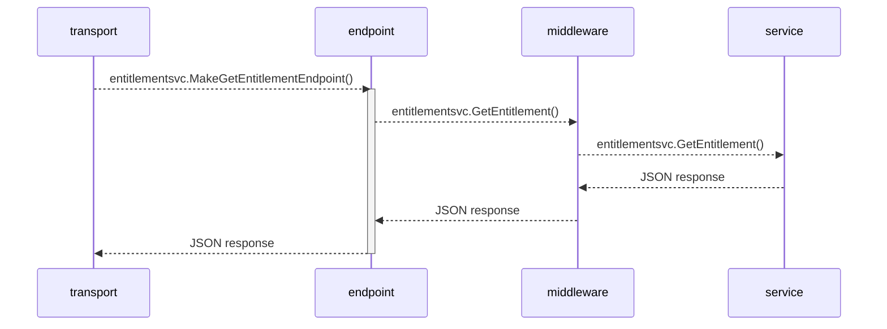

# A Microservice Reference Implementation in Golang
- To demonstrate a Web Service built using Golang with [Go kit](https://gokit.io/) library, which is a programming toolkit with circuit breaker, tracing, pluggable serialization, and more.
- A Go kit implementation have following layers:
  - Transport layer
  - Endpoint layer
  - Service layer
- Requests enter the service at layer 1, flow down to layer 3, and responses take the reverse course. Read more [here](https://gokit.io/faq/).
## Key Decisions
- [Go Kit](https://gokit.io/) being used a toolkit to avoid reinventing the wheel when it comes to 
RPC safety, system observability, infrastructure integration, and overall program design.
- Initial implementation is using REST as an interface (future support for gRPC)

## To RUN
- Run the application:
```
go run cmd/main.go
```
- Check the endpoint:
```
 curl http://localhost:8080/entitlement/01
```

## Sequence Diagram
